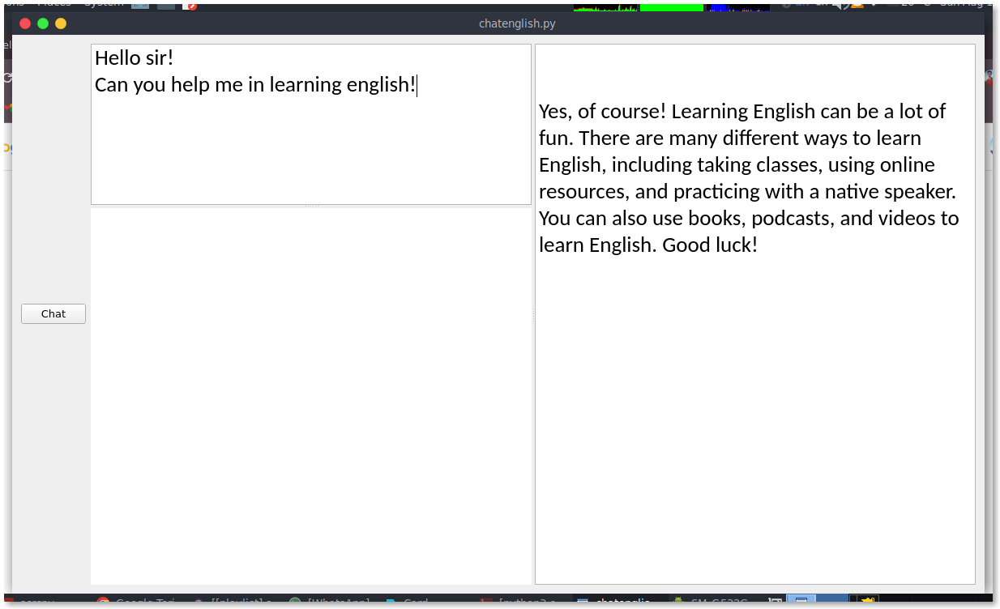

# English Chat Program

This program is a simple English chat application using the OpenAI API and PyQt5 library. It allows users to have text-based conversations with an AI model.

## Requirements

- Python 3.x
- PyQt5
- OpenAI

## Installation

1. Clone this repository to your local machine:

   ```bash
   git clone https://github.com/ahmadfajarrr/Chat_and_Voice_With_OpenAI.git
   cd Learning_English
   ```

2. Install the required dependencies using pip:

   ```bash
   pip install -r requirements.txt
   ```

3. Replace `"API_KEY_YOU"` in the code with your actual OpenAI API key.

## Usage

Run the program using the following command:

```bash
python chatenglish.py
```

The program will open a GUI window where you can type messages in the prompt box and click the "Chat" button to receive responses from the AI model.

## Features

- Conversational chat interface.
- Utilizes the OpenAI API for generating responses.
- GUI built using PyQt5.
- Text-based learning page integrated.

## Contributing

Contributions are welcome! Feel free to open issues or pull requests for any improvements or bug fixes.

## Example




